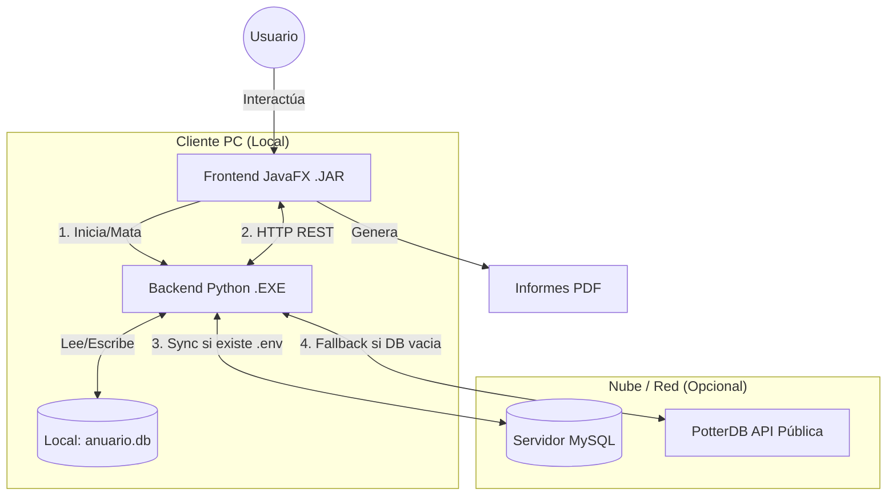
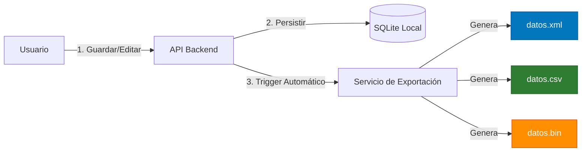

# Harry Potter Anuario - Aplicación Híbrida 🧙‍♂️✨

**Anuario Hogwarts** es una aplicación de escritorio moderna desarrollada en **Java (JavaFX)** y **Python (Flask)**. Utiliza una arquitectura híbrida única donde el frontend Java gestiona un backend Python autocontenido, ofreciendo lo mejor de ambos mundos: una interfaz rica y fluida, con la potencia de procesamiento de datos y librerías de Python.

---

## 🌟 Características Destacadas

### 🔄 Arquitectura "Smart Sync" (Offline-First)
*   **Modo Híbrido Automático**: La aplicación funciona perfectamente sin internet.
*   **Sincronización Inteligente**:
    *   **Offline**: Usa una base de datos local **SQLite** (`anuario.db`) optimizada para velocidad.
    *   **Online**: Si se configura un servidor remoto (**MySQL**), sincroniza datos bidireccionalmente (Push/Pull) bajo demanda.
    *   **Fallback Automático**: Si la base de datos está vacía, descarga automáticamente miles de personajes desde la API pública **PotterDB**.

### 🎨 Experiencia Visual Premium
*   **Splash Screen Animada**: Carga inicial con portada inmersiva a pantalla completa.
*   **Temas Dinámicos**:
    *   ☀️ **Light Mode (Hufflepuff):** Tonos cálidos y pergamino.
    *   🌙 **Dark Mode (Ravenclaw):** Interfaz oscura, elegante y cómoda para la vista.
*   **Diseño Responsivo**: Grid de tarjetas que se adapta a cualquier resolución (mínimo 850x700).

### 🚀 Rendimiento y Gestión
*   **Backend Autocontenido**: El motor Python se compila en un ejecutable (`backend_server.exe`), eliminando la necesidad de que el usuario final instale Python.
*   **Gestión de Procesos**: El lanzador (`Lanzador.java` / Frontend) inicia el motor automáticamente y asegura su cierre limpio ("Kill" de procesos zombies) al salir.
*   **Carga Asíncrona**: Descarga y procesamiento de imágenes en segundo plano sin congelar la interfaz.

## 🏗️ Diagrama de Arquitectura



## 🔄 Flujo de Datos y Exportación

Cada vez que se modifica un dato, el sistema garantiza la persistencia en múltiples formatos:



### 🛠️ Funcionalidades Core
*   **CRUD Completo**: Crear, Leer, Editar y Borrar personajes.
*   **Búsqueda Avanzada**: Filtrado por Nombre, Casa, Estado (Vivo/Fallecido), Patronus y Favoritos.
*   **Seguridad**: Login y Registro con "Master Password" para administradores.
*   **Informes PDF**: Generación profesional de fichas y listados usando **JasperReports**.

---

## 📦 Instalación y Ejecución (Usuario Final)

No requiere instalación de Python ni configuración compleja.

### Requisitos
*   **Sistema Operativo**: Windows 10/11 (x64).
*   **Java**: Tener instalado JRE/JDK 17 o superior.

### Pasos
1.  Descomprime la carpeta de la solución (`AnuarioApp`).
2.  Asegúrate de que los archivos `AnuarioMagico.jar` y `backend_server.exe` estén juntos.
3.  **Para ejecutar**: Doble clic en `AnuarioMagico.jar` (o ejecutar el acceso directo).

> **Nota para conexión remota**: Si deseas conectarte a la base de datos compartida del servidor, asegúrate de que el archivo `.env` esté presente en la misma carpeta. Si lo borras, la aplicación pasará a **Modo Local Offline**.

---

## ⚙️ Configuración (.env)

El archivo `.env` controla la conexión a la base de datos remota para el trabajo colaborativo.

```ini
# Configuración MySQL Remoto
DB_HOST=192.168.39.6      # IP del servidor de clase/empresa
DB_PORT=3306
DB_NAME=AnuarioMagico
DB_USER=tusuario
DB_PASSWORD=tupassword
```

---

## 🛠️ Guía para Desarrolladores (Build & Dev)

Si deseas modificar el código fuente:

### Estructura del Proyecto
```text
AnuarioMagico/
├── backend/                 # Código Fuente Python (API Flask)
│   ├── app.py               # Entry Point
│   ├── services/            # Lógica de sincronización y negocio
│   ├── routes/              # Endpoints REST
│   └── models/              # Modelos SQLAlchemy
├── frontend/                # Código Fuente Java (JavaFX)
│   ├── src/main/java/       # Controladores y Lógica UI
│   ├── src/main/resources/  # Vistas FXML, CSS, Imágenes
│   └── pom.xml              # Dependencias Maven
└── backend_server.spec      # Configuración PyInstaller
```

### Comandos de Compilación

#### 1. Backend (Generar EXE)
```powershell
# Activar entorno virtual
.venv\Scripts\activate
# Generar ejecutable en /dist
pyinstaller --clean --noconfirm backend_server.spec
```

#### 2. Frontend (Generar JAR)
```powershell
# Limpiar y empaquetar
mvn clean package
```

---

## 👨‍💻 Equipo de Desarrollo (Equipo Hagrid)

*   **Gaizka**: Arquitectura Híbrida, Integración Java-Python, Sincronización.
*   **Diego**: Diseño UI/UX, JasperReports, Base de Datos.
*   **Xiker**: Lógica de Negocio Backend, API REST, Seguridad.

---
© 2025 Anuario Hogwarts. Desarrollado con ☕ y ⚡.
