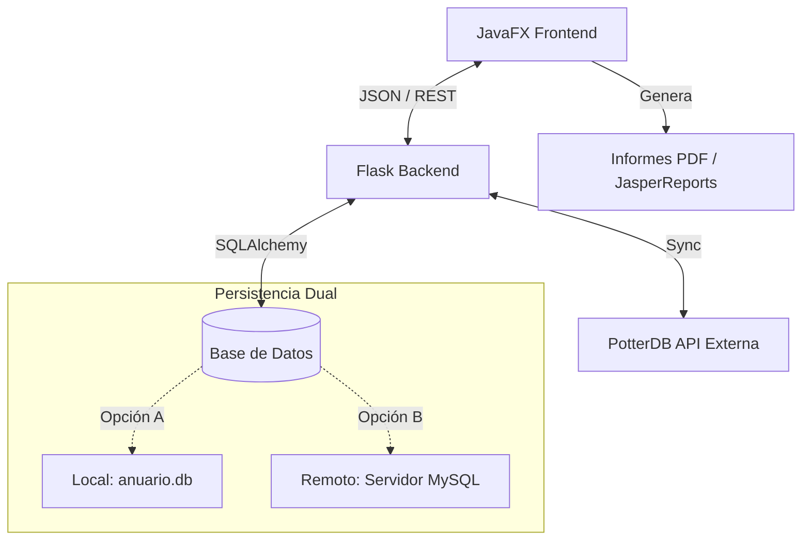

# Harry Potter Anuario - Aplicación Completa 🧙‍♂️✨

Aplicación de escritorio avanzada para gestionar un Anuario de Harry Potter. Combina una arquitectura moderna con **backend en Python (Flask)** y **frontend en JavaFX**, permitiendo escalar desde una base de datos local SQLite hasta un servidor MySQL remoto en la nube.

## 🎯 Características Principales

### 🔐 Seguridad y Autenticación
- **Login y Registro Completo:** Sistema seguro con 'Master Password' para nuevos registros.
- **Sesiones de Usuario:** Gestión de tokens para mantener la sesión activa.

### 💾 Base de Datos Híbrida (Dual DB Support)
- **Modo Local (SQLite):** Perfecto para desarrollo y pruebas offline. Todo se guarda en `backend/data/anuario.db`.
- **Modo Remoto (MySQL):** Conexión preparada para servidores de producción (ej. servidores de clase/empresa).
- **Switch Fácil:** Cambio instantáneo entre Local y Remoto editando una sola línea en el archivo `.env`.

### 🎨 Experiencia de Usuario (UX/UI)
- **Temas Personalizados:**
    - ☀️ **Light Mode (Hufflepuff Edition):** Tonos cremas y amarillos.
    - 🌙 **Dark Mode (Ravenclaw Edition):** Elegante azul noche y bronce.
- **Diseño Responsivo:** Interfaces cuidadas con CSS moderno (Glassmorphism, sombras, transiciones).

### 🛠️ Funcionalidades Avanzadas
- **Gestión de Personajes:**
    - Listado completo con buscador y filtros (Casa, Estado).
    - Favoritos persistentes en base de datos.
    - Edición de personajes (rol, estado, etc.).
- **Generación de Informes PDF:**
    - Exportación de fichas de personajes individuales.
    - Listados completos generados con **JasperReports**.
- **Internacionalización (i18n):** Preparado para múltiples idiomas (Español implementado).

---

## 🏗️ Arquitectura del Sistema



## 📁 Estructura del Proyecto

```
AnuarioMagico/
├── backend/
│   ├── app.py               # Punto de entrada Flask
│   ├── config.py            # Configuración Dual (SQLite/MySQL)
│   ├── routes/              # Endpoints (auth, characters, admin)
│   ├── models/              # Modelos SQLAlchemy (User, Character, Favorite)
│   ├── reports/             # Plantillas .jrxml para JasperReports
│   └── data/                # Almacenamiento local SQLite
├── frontend/
│   ├── src/main/java/org/GaizkaFrost/
│   │   ├── controllers/     # Lógica de vistas (Login, Main, Detail)
│   │   ├── services/        # Cliente API (HarryPotterAPI)
│   │   └── models/          # Objetos de datos Java
│   └── src/main/resources/
│       ├── fxml/            # Vistas (Login_view, Main_view...)
│       ├── styles/          # Temas CSS (estilos.css, login_ravenclaw.css...)
│       └── i18n/            # Archivos de traducción
├── .env                     # 🔑 Configuración Sensible (DB Switch)
├── .gitignore               # Ignora .env y datos locales
└── README.md
```

## 🚀 Instalación y Puesta en Marcha

### 1️⃣ Configuración del Backend (Python)

Necesitas Python 3.10 o superior.

```bash
# Navegar a la carpeta del proyecto
cd backend

# Crear entorno virtual
python -m venv .venv

# Activar entorno
# Windows:
.venv\Scripts\activate
# Mac/Linux:
source .venv/bin/activate

# Instalar dependencias (incluyendo pymysql, flask-sqlalchemy, jasper...)
pip install -r requirements.txt
```

#### ⚙️ Configurar Base de Datos (.env)
El proyecto incluye un archivo `.env` en la raíz para configurar la conexión.

**Para presentar en clase (Modo Seguro - Local):**
Asegúrate de que `DB_TYPE=sqlite` no esté comentado.
```ini
DB_TYPE=sqlite
DB_SQLITE_FILE=data/anuario.db
# MySQL comentado...
```

**Para conectar al Servidor Remoto:**
Comenta las líneas de SQLite y descomenta las de MySQL:
```ini
# DB_TYPE=sqlite
DB_TYPE=mysql
DB_HOST=192.168.39.6
DB_NAME=usuarioDidaktikapp
...
```

### 2️⃣ Ejecutar Backend
```bash
python app.py
```
Verás un mensaje indicando qué base de datos se está usando: `--> Usando base de datos SQLite Local` o `MySQL Remoto`.

### 3️⃣ Ejecutar Frontend (JavaFX)

Desde tu IDE (VS Code / IntelliJ) o terminal:
```bash
cd frontend
mvn clean javafx:run
```

---

## 🎮 Guía de Usuario

1.  **Login / Registro:**
    *   Si es tu primera vez, pulsa el checkbox **"¿No tienes cuenta?"**.
    *   Introduce un usuario y contraseña.
    *   **Master Password:** Necesario para registrarse (por defecto: `HogwartsMaster`).
2.  **Dashboard:**
    *   Usa los filtros superiores para buscar por casa o nombre.
    *   Pulsa la **Luna/Sol** arriba a la derecha para cambiar entre tema Ravenclaw (Oscuro) y Hufflepuff (Claro).
3.  **PDFs:**
    *   En el detalle de un personaje, pulsa **"Generar PDF"** para obtener su ficha.
    *   En la vista principal, usa el botón de imprimir para un listado completo.

## 👨‍💻 Autores
Proyecto desarrollado por **Gaizka, Xiker y Diego**.
Diseñado como solución completa para la gestión de datos mágicos.
